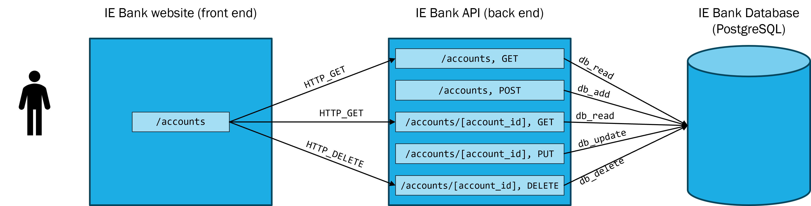

# IE Bank infrastructure

- [IE Bank infrastructure](#ie-bank-infrastructure)
  - [Overview](#overview)
  - [Requirements](#requirements)
  - [Recommended tutorials](#recommended-tutorials)
  - [Configure your local environment](#configure-your-local-environment)
    - [Install Prerequisites](#install-prerequisites)
  - [Repository organization](#repository-organization)
    - [`Main.bicep`](#mainbicep)
    - [Module `app-service.bicep`](#module-app-servicebicep)
  - [Configuration variables](#configuration-variables)
  - [Continuos Delivery](#continuos-delivery)
    - [GitHub secrets](#github-secrets)
    - [GitHub variables](#github-variables)

## Overview

This is the repository for the infrastructure code of the IE Bank web app

## Requirements

This source code works under the following technologies:
- [Azure CLI 2.51.0](https://learn.microsoft.com/en-us/cli/azure/install-azure-cli)

## Recommended tutorials

- [Azure CLI](https://learn.microsoft.com/en-us/cli/azure/get-started-with-azure-cli)
- [Azure Bicep](https://learn.microsoft.com/en-us/azure/azure-resource-manager/bicep/overview?tabs=bicep)
- [Bicep CLI](https://learn.microsoft.com/en-us/azure/azure-resource-manager/bicep/bicep-cli)
- [Learn modules for Bicep](https://learn.microsoft.com/en-us/azure/azure-resource-manager/bicep/learn-bicep)
- [Quickstart: Create Bicep files with Visual Studio Code](https://learn.microsoft.com/en-us/azure/azure-resource-manager/bicep/quickstart-create-bicep-use-visual-studio-code?tabs=CLI)
- [Deploy Azure resources by using Bicep and GitHub Actions](https://learn.microsoft.com/en-us/training/paths/bicep-github-actions/)
- [Quickstart: Use a Bicep file to create an Azure Database for PostgreSQL - Flexible Server](https://learn.microsoft.com/en-us/azure/postgresql/flexible-server/quickstart-create-server-bicep?toc=%2Fazure%2Fazure-resource-manager%2Fbicep%2Ftoc.json&tabs=CLI)

## Configure your local environment

### Install Prerequisites

- **Install Azure CLI**. Install Azure CLI from [here](https://docs.microsoft.com/en-us/cli/azure/install-azure-cli). Make sure to select the option to add Azure CLI to your PATH while installing.
- **Install Visual Studio Code and Bicep extension**. Install Visual Studio Code from [here](https://code.visualstudio.com/download). Install the Bicep extension from [here](https://marketplace.visualstudio.com/items?itemName=ms-azuretools.vscode-bicep). You can also follow the steps from the article [Install Bicep tools](https://learn.microsoft.com/en-us/azure/azure-resource-manager/bicep/install#visual-studio-code-and-bicep-extension)

## Repository organization

### `Main.bicep`

The script that will deploy the infrastructure for IE Bank app is [`main.bicep`](main.bicep).

The script deploys:

Resource | Azure Documentation | Bicep resource definition | Description
--- | --- | --- | ---
**PostgreSQL server** | [Azure Database for PostgreSQL - Flexible Server](https://docs.microsoft.com/en-us/azure/postgresql/flexible-server/overview) | [Microsoft.DBforPostgreSQL flexibleServers 2022-12-01](https://learn.microsoft.com/en-us/azure/templates/microsoft.dbforpostgresql/2022-12-01/flexibleservers?pivots=deployment-language-bicep) | PostgreSQL server for the IE Bank app
**PostgreSQL database** | [Azure Database for PostgreSQL - Flexible Server](https://docs.microsoft.com/en-us/azure/postgresql/flexible-server/overview) | [Microsoft.DBforPostgreSQL flexibleServers/databases 2022-12-01](https://learn.microsoft.com/en-us/azure/templates/microsoft.dbforpostgresql/2022-12-01/flexibleservers/databases?pivots=deployment-language-bicep) | PostgreSQL database for the IE Bank app
**module `modules/app-service`** | See [Module `app-service.bicep`](#module-app-servicebicep) | - | Bicep module that deploys the web app services for the IE Bank app

### Module `app-service.bicep`

The `main.bicep` script uses the module [`modules/app-service.bicep`](.\modules\app-service.bicep) to deploy the web app services for the IE Bank app.

The module deploys:

Resource | Azure Documentation | Bicep resource definition | Description
--- | --- | --- | ---
**App Service Plan** | [Azure App Service plan overview](https://docs.microsoft.com/en-us/azure/app-service/overview-hosting-plans) | [Microsoft.Web/serverfarms 2021-02-01](https://docs.microsoft.com/en-us/azure/templates/microsoft.web/2021-03-01/serverfarms) | App Service Plan for the IE Bank app
**Linux App Service** | [Azure App Service overview](https://docs.microsoft.com/en-us/azure/app-service/overview) | [Microsoft.Web/sites 2021-02-01](https://docs.microsoft.com/en-us/azure/templates/microsoft.web/2021-03-01/sites) | Linux App Service to host the IE Bank app backend
**Linux App Service** | [Azure App Service overview](https://docs.microsoft.com/en-us/azure/app-service/overview) | [Microsoft.Web/sites 2021-02-01](https://docs.microsoft.com/en-us/azure/templates/microsoft.web/2021-03-01/sites) | Linux App Service to host the IE Bank app frontend

## Configuration variables

To determine different configuration options for each environment, we will make use of the files under the [`parameters`](./parameters/) folder.
- File [`parameters/dev.parameters.json`](./parameters/dev.parameters.json) contains the configuration for the development environment.

## Continuos Delivery

> Learn more: 
>- [Deploy Azure resources by using Bicep and GitHub Actions](https://learn.microsoft.com/en-us/training/paths/bicep-github-actions/)

The file [`.github/workflows/ie-banc-infra.yml`](.github\workflows\ie-bank-infra.yml) contains the configuration for the CI/CD pipeline.

### GitHub secrets

The workflow uses the following GitHub secrets:

Secret name | Description | Learn more
--- | --- | ---
`AZURE_CREDENTIALS` | Azure credentials to authenticate to Azure via Service Principal | [Use the Azure login action with a service principal secret](https://learn.microsoft.com/en-us/azure/developer/github/connect-from-azure?tabs=azure-portal%2Clinux#use-the-azure-login-action-with-a-service-principal-secret)
`DBPASS` | Password for the PostgreSQL server, configured as App Setting in the backend web server | [Environment variables and app settings in Azure App Service](https://learn.microsoft.com/en-us/azure/app-service/reference-app-settings?tabs=kudu%2Cdotnet)
`DBUSER` | Username for the PostgreSQL server, configured as App Setting in the backend web server | [Environment variables and app settings in Azure App Service](https://learn.microsoft.com/en-us/azure/app-service/reference-app-settings?tabs=kudu%2Cdotnet)

### GitHub variables

The workflow uses the following GitHub variables:

Variable name | Description | Learn more
--- | --- | ---
`DBHOST` | Hostname for the PostgreSQL server, configured as App Setting in the backend web server | [Environment variables and app settings in Azure App Service](https://learn.microsoft.com/en-us/azure/app-service/reference-app-settings?tabs=kudu%2Cdotnet)
`DBNAME` | Name for the PostgreSQL database, configured as App Setting in the backend web server | [Environment variables and app settings in Azure App Service](https://learn.microsoft.com/en-us/azure/app-service/reference-app-settings?tabs=kudu%2Cdotnet)
`ENV` | Environment name, configured as App Setting in the backend web server  | [Environment variables and app settings in Azure App Service](https://learn.microsoft.com/en-us/azure/app-service/reference-app-settings?tabs=kudu%2Cdotnet)
`FLASK_APP` | Name of the flask app to run, configured as App Setting in the backend web server  | [Environment variables and app settings in Azure App Service](https://learn.microsoft.com/en-us/azure/app-service/reference-app-settings?tabs=kudu%2Cdotnet)
`FLASK_DEBUG` | Debug option for the flask app, configured as App Setting in the backend web server  | [Environment variables and app settings in Azure App Service](https://learn.microsoft.com/en-us/azure/app-service/reference-app-settings?tabs=kudu%2Cdotnet)

some new text